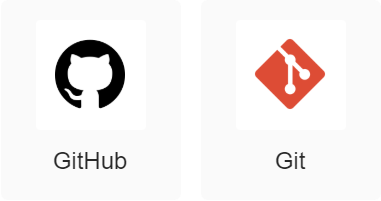

# dev-skills-for-junior-developer

무형문화연구원 신입 개발자를 위한 정보가 담긴 레포지토리

> 이 문서는 개발자의 도움이 필요합니다. 질문이나 좋은 아이디어가 있다면 [**Discussions**](https://github.com/cics-system-team/dev-skills-for-junior-developer/discussions)에 남겨주세요

## 공통

### 버전 관리

- [Git](/contents/common/version_control.md#git) : 버전 관리 시스템
- [GitHub](/contents/common/version_control.md#github) : Git 기반 온라인 버전 관리 서비스
- [Git Flow](/contents/common/version_control.md#git-flow)

### 협업툴

- Slack : 알림, 커뮤니테이션 등의 협업이 가능한 도구
  - GitHub, PM2 등과 연동 가능

### 벤치마크툴

- [Gatling](/contents/common/benchmark/gatling.md) : 부하 테스트 및 벤치마크 툴

## 서버/운영체제

### 리눅스

- POSIX 명령어
- 서버 기초 설정법

### AWS

- [AWS(아마존 웹 서비스)](/contents/server/aws.md)
  - EC2 인스턴스 다루는 법
  - EBS 용량 확장법
  - 보안 그룹 설정법
  - 탄력적 IP

## 프론트엔드

- HTML5 : 웹 콘텐츠의 의미와 구조를 정의할 때 사용하는 마크업 언어
- CSS3 : HTML로 작성된 문서의 표시 방법을 기술하기 위한 스타일 시트 언어
- JavaScript: 웹 페이지를 위한 스크립트 언어
- 템플릿 엔진
  - [Thymeleaf](https://www.thymeleaf.org/) : Spring에서 사용하는 템플릿 엔진
  - [DTL](https://docs.djangoproject.com/en/4.0/topics/templates/) : Django에서 사용하는 템플릿 엔진
- React: 사용자 인터페이스를 만들기 위한 JavaScript 라이브러리
  - JSX
  - [styled-components](https://styled-components.com/)

## 백엔드

### 언어

- Java/Kotlin
- Python
- SQL

### 웹프레임워크

- SpringBoot : Java 또는 Kotlin 학습이 선행되어야 함
  - Gradle : SpringBoot 관리에 사용
  - yaml : SpringBoot 설정 파일에 사용
  - JPA : 데이터베이스 ORM
- Django : Python 학습이 선행되어야 함
  - venv : 일관성있는 파이썬 실행을 보장하기 위한 가상 환경
  - wsgi : 웹서버와 파이썬을 연결시켜주는 인터페이스

### 데이터베이스

- [MariaDB](/contents/backend/database.md) : 설치, 초기 설정 익히기

## 서비스

### 웹서버

- nginx : 무형문화연구원에서 주로 사용하는 웹 서버
- Apache

### 배포/자동화

- POSIX 명령어 : nohup 명령어와 & 키워드의 사용법 익히기
- Github Actions : CI/CD를 할 수 있는 자동화 도구
- [PM2](/contents/service/pm2.md) : 서비스 배포 시 사용하는 프로그램
  - 참고) [PM2를 활용한 Node.js 무중단 서비스하기](https://engineering.linecorp.com/ko/blog/pm2-nodejs/)

### 보안

- [HTTPS](/contents/service/https.md) : TLS 인증서를 사용한 안전한 HTTP 통신
