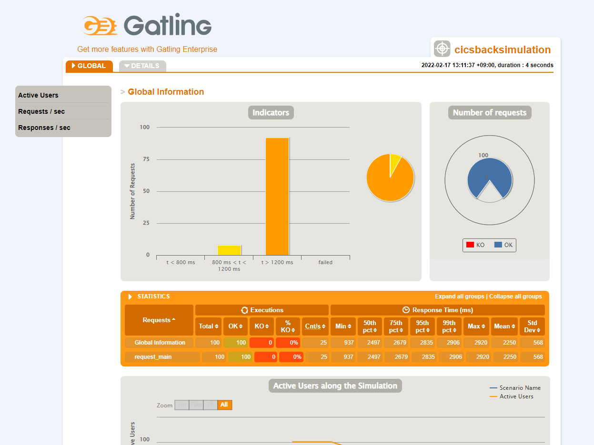

# Gatling

[홈페이지](https://gatling.io/)

## 다운로드

[링크](https://gatling.io/open-source/)

## 사용법

1. 다운로드 받은 파일을 압축해제한다.

   폴더 구조

   ```shell
   .
   ├── bin
   │   ├── enterpriseDeploy.bat
   │   ├── enterpriseDeploy.sh
   │   ├── enterprisePackage.bat
   │   ├── enterprisePackage.sh
   │   ├── gatling.bat
   │   ├── gatling.sh
   │   ├── recorder.bat
   │   └── recorder.sh
   ├── conf
   │   ├── gatling-akka.conf
   │   ├── gatling.conf
   │   ├── logback.xml
   │   └── recorder.conf
   ├── lib
   │   └── ...
   ├── LICENSE
   ├── results
   │   └── cicsbacksimulation-20220217014122009
   │       ├── index.html
   │       ├── js
   │       │   └── ...
   │       ├── req_request-main-542f5.html
   │       ├── simulation.log
   │       └── style
   │           └── ...
   ├── target
   │   └── ...
   └── user-files
       ├── resources
       │   └── search.csv
       └── simulations
           └── computerdatabase
               ├── advanced
               │   ├── AdvancedSimulationStep01.java
               │   ├── AdvancedSimulationStep02.java
               │   ├── AdvancedSimulationStep03.java
               │   ├── AdvancedSimulationStep04.java
               │   └── AdvancedSimulationStep05.java
               ├── BasicSimulation.java
               └── CicsBackSimulation.java

   34 directories, 377 files

   ```

2. `./user-files/simulations/` 폴더에 테스트하고자 하는 코드를 기입한다.

   `CicsBackSimulation.java` 예시

   ```java
   package computerdatabase;

   import static io.gatling.javaapi.core.CoreDsl.*;
   import static io.gatling.javaapi.http.HttpDsl.*;

   import io.gatling.javaapi.core.*;
   import io.gatling.javaapi.http.*;
   import java.time.Duration;

   public class CicsBackSimulation extends Simulation {

   HttpProtocolBuilder httpProtocol =
       http
               .baseUrl("http://localhost:8080")
               .acceptHeader("text/html,application/xhtml+xml,application/xml;q=0.9,*/*;q=0.8")
               .doNotTrackHeader("1")
               .acceptLanguageHeader("en-US,en;q=0.5")
               .acceptEncodingHeader("gzip, deflate")
               .userAgentHeader("Mozilla/5.0 (Macintosh; Intel Mac OS X 10.8; rv:16.0) Gecko/20100101 Firefox/16.0")
               .shareConnections();

   ScenarioBuilder scn = scenario("Scenario Name")
           .exec(http("request_main").get("/v1/index"));

   {
       setUp(
       scn
           .injectOpen(atOnceUsers(100))
           .protocols(httpProtocol)
       );
   }
   }

   ```

3. `/bin/gatling.bat`을 실행한다. (리눅스라면 `/bin/gatling.sh`로)

   ```shell
   GATLING_HOME is set to "C:\Users\username\Downloads\gatling-charts-highcharts-bundle-3.7.5"
   JAVA = ""C:\Program Files\Eclipse Adoptium\jdk-17.0.2.8-hotspot\\bin\java.exe""
   OpenJDK 64-Bit Server VM warning: Option UseBiasedLocking was deprecated in version 15.0 and will likely be removed in a future release.
   Choose a simulation number:
       [0] computerdatabase.BasicSimulation
       [1] computerdatabase.CicsBackSimulation
       [2] computerdatabase.advanced.AdvancedSimulationStep01
       [3] computerdatabase.advanced.AdvancedSimulationStep02
       [4] computerdatabase.advanced.AdvancedSimulationStep03
       [5] computerdatabase.advanced.AdvancedSimulationStep04
       [6] computerdatabase.advanced.AdvancedSimulationStep05
   ```

4. 자기가 생성한 시뮬레이션 이름에 맞는 번호를 입력한다.

   ```shell
   GATLING_HOME is set to "C:\Users\username\Downloads\gatling-charts-highcharts-bundle-3.7.5"
   JAVA = ""C:\Program Files\Eclipse Adoptium\jdk-17.0.2.8-hotspot\\bin\java.exe""
   OpenJDK 64-Bit Server VM warning: Option UseBiasedLocking was deprecated in version 15.0 and will likely be removed in a future release.
   Choose a simulation number:
       [0] computerdatabase.BasicSimulation
       [1] computerdatabase.CicsBackSimulation
       [2] computerdatabase.advanced.AdvancedSimulationStep01
       [3] computerdatabase.advanced.AdvancedSimulationStep02
       [4] computerdatabase.advanced.AdvancedSimulationStep03
       [5] computerdatabase.advanced.AdvancedSimulationStep04
       [6] computerdatabase.advanced.AdvancedSimulationStep05
   1
   Select run description (optional)

   Simulation computerdatabase.CicsBackSimulation started...

   ================================================================================
   2022-02-17 13:11:41                                           3s elapsed
   ---- Requests ------------------------------------------------------------------
   > Global                                                   (OK=100    KO=0     )
   > request_main                                             (OK=100    KO=0     )

   ---- Scenario Name -------------------------------------------------------------
   [##########################################################################]100%
           waiting: 0      / active: 0      / done: 100
   ================================================================================

   Simulation computerdatabase.CicsBackSimulation completed in 3 seconds
   Parsing log file(s)...
   Parsing log file(s) done
   Generating reports...

   ================================================================================
   ---- Global Information --------------------------------------------------------
   > request count                                        100 (OK=100    KO=0     )
   > min response time                                    937 (OK=937    KO=-     )
   > max response time                                   2920 (OK=2920   KO=-     )
   > mean response time                                  2250 (OK=2250   KO=-     )
   > std deviation                                        568 (OK=568    KO=-     )
   > response time 50th percentile                       2497 (OK=2497   KO=-     )
   > response time 75th percentile                       2679 (OK=2679   KO=-     )
   > response time 95th percentile                       2835 (OK=2835   KO=-     )
   > response time 99th percentile                       2906 (OK=2906   KO=-     )
   > mean requests/sec                                     25 (OK=25     KO=-     )
   ---- Response Time Distribution ------------------------------------------------
   > t < 800 ms                                             0 (  0%)
   > 800 ms < t < 1200 ms                                   8 (  8%)
   > t > 1200 ms                                           92 ( 92%)
   > failed                                                 0 (  0%)
   ================================================================================

   Reports generated in 0s.
   Please open the following file: C:\Users\username\Downloads\gatling-charts-highcharts-bundle-3.7.5\results\cicsbacksimulation-20220217041137069\index.html
   계속하려면 아무 키나 누르십시오 . . .
   ```

5. 결과 확인

   `./results/cicsbacksimulation-20220217041137069/index.html` 파일을 브라우저로 보면 결과를 시각화해서 확인할 수 있다.
   
