[홈](https://github.com/cics-system-team/dev-skills-for-junior-developer) > 서버/운영체제 > AWS

# 아마존 웹 서비스

## 인스턴스 스토리지 용량 확장

EC2의 스토리지 용량은 EBS(Elastic Block Store)로 관리한다.

### 볼륨 확장 방법

1. AWS Elastic Block Store에서 수정하려는 볼륨을 우클릭한다.

   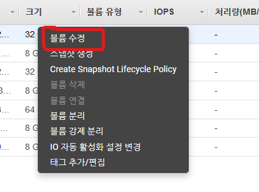

2. 원하는 볼륨 크기로 수정한다. (현재 용량에서 확대하는 것만 가능하다.)

   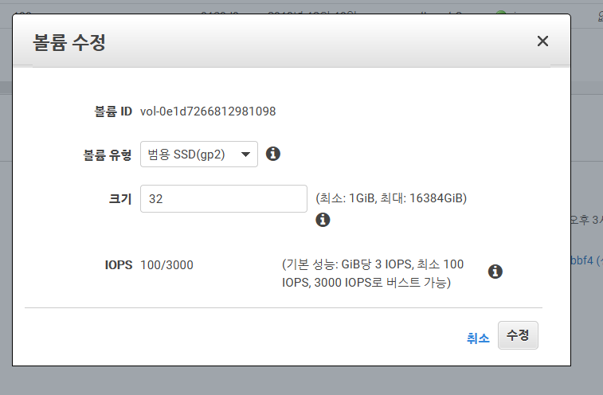

3. lsblk 명령어로 현재 파티션을 확인한다.

   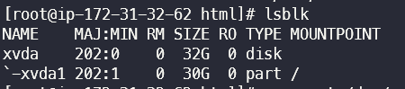

4. growpart /dev/xvda 1 명령어로 파티션을 확장한다. (xvda와 같은 볼륨 명칭은 변경될 수 있다)

   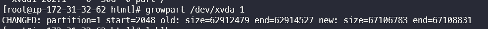

5. lsblk 명령어로 파티션이 확장되었는지 다시 확인한다.

   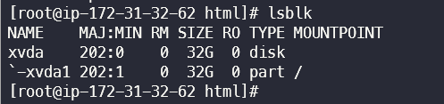

6. xfs_growfs -d / 명령어로 루트 디렉토리를 확장한다.

   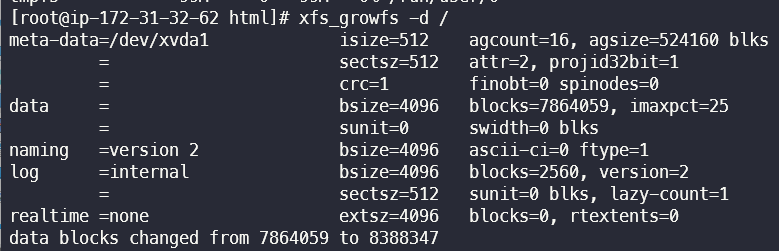

7. df 명령어로 디렉토리가 정상적으로 확장되었는지 확인한다.

   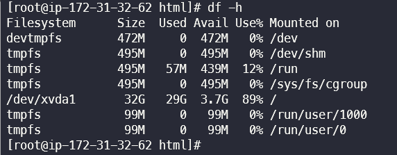

### 볼륨 연결 방법

1. 인스턴스가 중지되어있는 상태에서 인스턴스에 볼륨 연결을 선택한다. (아래 사진은 이미 연결되어있는상태.)

   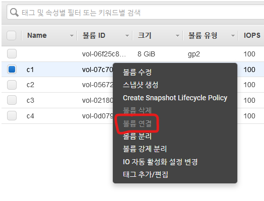

2. SSH로 접속 후 sudo fdisk -l 로 연결된 볼륨을 확인한다.

   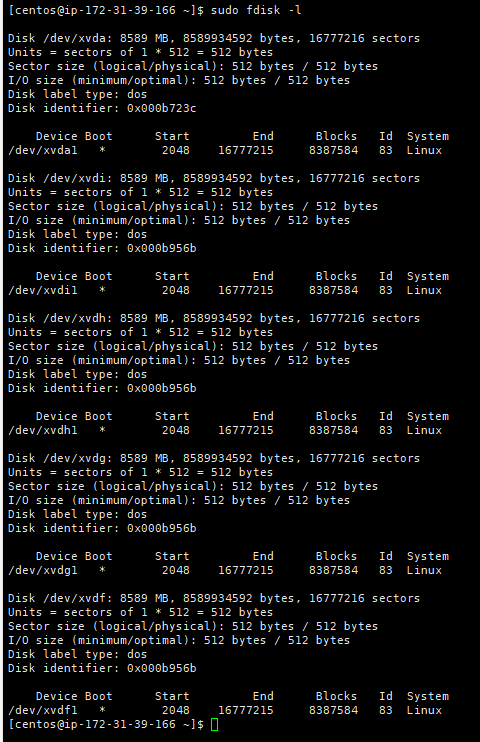

3. /mnt/에 마운트할 폴더를 생성한다.

   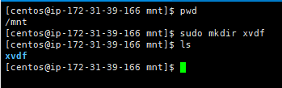

4. sudo mount [Device명] [Mount할 폴더명] 명령어로 디스크를 마운트한다. (Device명은 2번 항목에 fdisk 명령어 사용시 보이는 /dev/~~~이다.)

   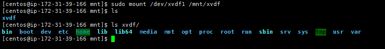

5. 마운트 확인은 df 명령어로 한다.

   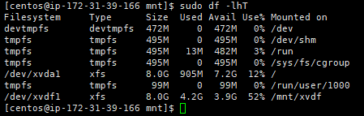

6. 마운트 분리는 umount 명령어로 한다. (Device명으로 해도 되고, Mount된 폴더 명으로 해도 된다)

   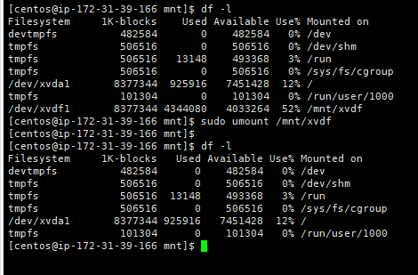
